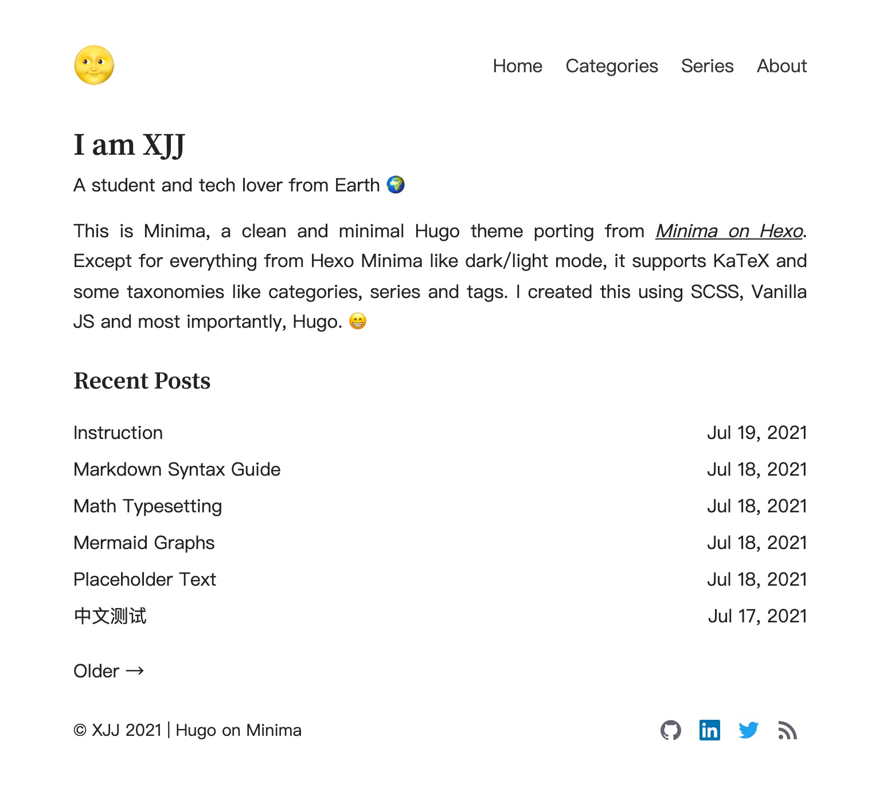

# Minima

This project was originally a Hugo port of the [Hexo Minima](https://github.com/adisaktijrs/hexo-theme-minima). A lot of changes have been made so far to make Minima cooler.


Links: [Demo Site](https://h.xjj.pub/), [Demo Configs](../exampleSite/), [Author's Blog](https://xjj.pub)


> The main branch is in development stage, UI or configuration may vary. You can use the latest stable version [here](https://github.com/Mivinci/hugo-theme-minima/releases/tag/v1.1.0).



## Features

- [x] Clean
- [x] Light/dark mode
- [x] VSCode-style code hightlighting (the most alike among all Hugo themes)
- [x] KaTeX
- [x] Mermaid diagrams
- [x] Google analytics
- [x] Disqus/Utterances
- [x] Optional ToC
- [x] External link post
- [x] RSS

## Usage

Before using Minima, make sure you've got Hugo (extended version) installed on your device.

### Installation

Suppose `blog` is where you place your sources.

```bash
cd blog
git init
git submodule add --depth 1 https://github.com/mivinci/hugo-theme-minima.git themes/minima
```

Or  `clone` directly if you don't wanna use the Git submodule.

```bash
git clone https://github.com/mivinci/hugo-theme-minima.git themes/minima
```

Anyways, you just need to put Minima under the `blog/themes` directory.

### Configuration

Follow [exampleSite/config.toml](https://github.com/Mivinci/hugo-theme-minima/blob/main/exampleSite/config.toml) and edit your own `blog/config.toml` file.

### Supported Front Matters

| Field       | Type   | Explanation                                            |
|:----------- |:------ |:------------------------------------------------------ |
| title       | string | Title of the post                                      |
| description | string | Description of the post                                |
| date        | string | Datetime when the post is written                      |
| link        | string | If set, the post will redirect to an external link     |
| categories  | array  | Array of categories the posts belongs to               |
| series      | array  | Array of series the post belongs to                    |
| tags        | array  | Array of tags the posts is related to                  |
| math        | bool   | True if the post needs to render math formulas         |
| mermaid     | bool   | True if the post needs to render mermaid diagrams      |
| comment     | bool   | True if the post allows people to make comments        |
| draft       | bool   | True if the post isn't already for publishing          |
| toc         | bool   | True if the post needs a ToC                           |

### External Link Post

Use the `link` in the front matter to make a post a specific external link. Such external link post will redirect to the link provided.

**Example**

```yaml
---
author: XJJ
title: External Link Post
date: 2021-07-17T10:52:59+08:00
link: https://gohugo.io
---
```

And when you click the title in the list page, you will be redireted to https://gohugo.io, which's 🆒.

### RSS Feeds

v1.1.0 and later versions support subscription to external RSS feeds whereas titles and links to your friends' posts can be displayed in your blog site. For details, see `friends` in the [configuaration](./exampleSite/config.toml)

**Example**

```yaml
[params.friends]
feeds = ["https://xjj.pub/index.xml"]
topk = 3
title = "Friends' Posts"
```

### Feedback

Feedbacks are welcome [here](https://github.com/Mivinci/hugo-theme-minima/issues).
